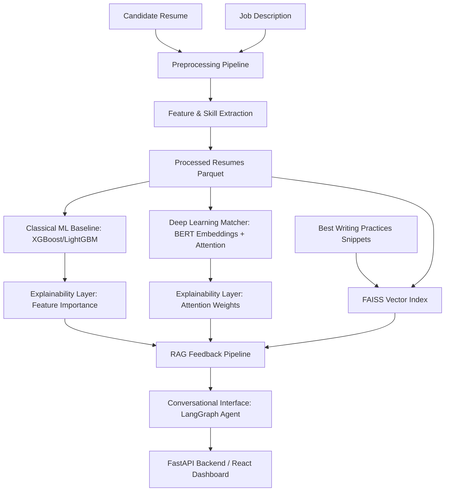

# ResumeIQ

ResumeIQ is an end-to-end, locally-runnable AI system that evaluates candidate resumes against job requirements, produces personalized, explainable feedback, and provides a conversational interface for candidates to discuss their results.

## Table of Contents
- [Architecture](#architecture)
- [Features](#features)
- [Prerequisites](#prerequisites)
- [Setup](#setup)
- [CLI Usage](#cli-usage)
- [Running Tests](#running-tests)
- [Project Structure](#project-structure)
- [How Scoring Works](#how-scoring-works)
- [Phase 1 EDA Summary](#phase-1-eda-summary)
- [Known Limitations](#known-limitations)
- [Sample Feedback Report](#sample-feedback-report)

---

## Architecture



## Features
- **Resume-to-JD fit scoring** combining a classical ML baseline (XGBoost/LightGBM) with a BERT-based semantic similarity score
- **Explainable breakdowns**: matched/missing skills, experience gap, education fit, feature importances, and attention-weight highlights
- **Retrieval-grounded feedback**: FAISS-indexed writing-best-practice snippets and higher-scoring peer resumes, used to generate suggestions tied to specific gaps
- **Conversational agent**: a LangGraph ReAct agent that answers candidate follow-up questions using tool calls against the actual score data, not free-form generation
- **React dashboard**: upload/paste a resume, pick or paste a job description, view the score breakdown, feedback report, and chat panel

## Prerequisites
- Python 3.13.5
- Node.js (for the frontend)
- Ollama (optional — for local LLM-generated feedback text; without it, feedback falls back to a template-based generator, and chat falls back to a demo-mode mock LLM router that responds using tool data only)

---

## Setup

**1. Backend**
```bash
cd backend
python -m venv .venv
.venv\Scripts\activate        # on macOS/Linux: source .venv/bin/activate
pip install -r requirements.txt
```

**2. Frontend**
```bash
cd frontend
npm install
```

**3. Prepare the data** (run once — see [CLI Usage](#cli-usage) below)
```bash
cd backend
python -m src.cli prepare-data
```

**4. Run the backend**
```bash
cd backend
python -m uvicorn src.api:app --host 127.0.0.1 --port 8000 --reload
```

**5. Run the frontend** (in a separate terminal)
```bash
cd frontend
npm run dev
```
Open the URL Vite prints (typically http://localhost:5173).

---

## CLI Usage
Run these from `backend/`:

```bash
# One-time: clean + extract features + run EDA + synthesize job descriptions
python -m src.cli prepare-data

# End-to-end scoring demo: score, explainability, retrieval, and one agent turn
python -m src.cli run-pipeline
```

## Running Tests
```bash
cd backend
python -m pytest tests/ -v
```
22 tests covering preprocessing, models, the agent, and the API.

---

## Project Structure

```text
resumeiq/
  README.md
  .gitignore
  backend/
    requirements.txt
    conftest.py
    src/
      cli.py             # Unified CLI: prepare-data | run-pipeline
      preprocessing.py   # OCR cleaning + entity extraction
      models.py          # XGBoost/LightGBM baseline + DistilBERT encoder
      retrieval.py       # FAISS vector store + RAG indexer
      feedback.py        # Fit scoring breakdown + feedback generator
      agent.py           # LangGraph ReAct conversational agent
      api.py             # FastAPI backend
    tests/               # PyTest suite (22 tests)
    data/
      raw/               # resumes_dataset.jsonl
      processed/         # processed_resumes.parquet + job_descriptions.jsonl
    artifacts/           # Model files, vectorizer, embeddings & FAISS index
  frontend/
    ...                  # Vite/React + Tailwind CSS v4
```

---

## How Scoring Works
The ResumeIQ fit score is a structured, rebalanced composite score designed to weigh candidate qualifications fairly and prevent keyword stuffing. It is **not** a single end-to-end learned prediction.

$$\text{Fit Score} = 0.40 \cdot \text{Skill Overlap} + 0.30 \cdot \text{Experience Match} + 0.15 \cdot \text{Degree Match} + 0.15 \cdot \text{Model Semantic Score}$$

| Sub-score | Weight | What it measures |
|---|---|---|
| Skill Overlap | 40% | `matched_skills / required_skills` — direct technical keyword overlap |
| Experience Match | 30% | `1.0` if candidate meets/exceeds required years; otherwise `max(0.0, 1.0 - gap/required_experience)` |
| Degree Match | 15% | Binary: does highest degree (None/Bachelor's/Master's/PhD) meet or exceed the requirement |
| Model Semantic Score | 15% | Trained model's probability output, incorporating TF-IDF cosine similarity — overall vocabulary/semantic alignment |

## Phase 1 EDA Summary
Computed on the corrected corpus (post text-cleaning fix):
- **3,124 unique resumes** after removing 376 near-duplicates from the original 3,500
- **Field completeness**: 100% across all raw fields (ResumeID, Category, Name, Email, Phone, Location, Summary, Skills, Experience, Education, Text, Source)
- **Top 5 categories**: Data Science (170, 5.44%), Java Developer (168, 5.38%), Python Developer (161, 5.15%), SQL Developer (149, 4.77%), DevOps (140, 4.48%)
- **Cleaned text length**: min 202, max 55,681, mean 3,126, median 1,845 characters

## Known Limitations
1. **Synthetic seed job descriptions** — the raw dataset has no target JDs, so 40 were programmatically synthesized (`data/job_descriptions.jsonl`); these are demo/test templates, not real postings.
2. **Category as a weak label** — the resume `Category` field is used as a proxy for "best-fit role," not a validated hiring outcome.
3. **No spaCy/SHAP** — by design, no external NER libraries or SHAP explainers are used. Extraction is regex + dictionary-based; explainability comes from model feature importances and BERT attention weights.
4. **Zero-experience resumes** — ~39% of resumes have no stated numeric years of experience (or unfilled template placeholders), extracted as 0.0 years.
5. **LoRA fine-tuning** — not attempted, to avoid high CPU overhead during contrastive training.
6. **Fallback demo-mode chat** — if no local LLM (Ollama) is configured, `/chat` responses are generated from tool data via a template router rather than free-form generation; the UI shows a visible "Fallback Demo Mode" badge when this is active.

---

## Sample Feedback Report
Generated by ResumeIQ for candidate `REAL_0001` (Java Developer) against `JD_0001` (Senior Java Developer):

<details>
<summary>Click to expand</summary>

# ResumeIQ Feedback Report
**Target Role:** Senior Java Developer (Java Developer)
**Candidate ID:** REAL_0001 | **Fit Score:** 55.4%

## Score & Explainability Summary
ResumeIQ calculated a fit score of 55.4% for this role, driven primarily by a skill overlap of 17% and semantic text similarity. The candidate matches core skills such as Java. However, key required skills like CI/CD, Docker, Git, and 2 other(s) are missing. The candidate's 12.0 years of experience successfully meets the required 5.0 years. The candidate's education (Bachelor's) meets or exceeds the required Bachelor's. Additionally, the neural model's attention highlights that terminology surrounding 'implemented, including, designs' in the resume was highly influential during matching.

## Actionable Suggestions (Grounded in Gaps)
### Technical Skills Alignment
*Gaps Addressed: Missing Skills (CI/CD, Docker, Git, SQL, Spring Boot)*
**[Addresses Gap: Missing Skills]** Your resume is currently missing key skills listed in the job description: **CI/CD, Docker, Git, SQL, Spring Boot**.
- Group technical skills into clear subcategories (e.g., Languages, Frameworks, Cloud/DevOps, Databases) to make the skills section highly scannable.

### General Formatting & Action Words
**[Addresses Gap: General Scannability]** To maximize parsing rates and highlight your strengths:
- Mention the data manipulation libraries (Pandas, NumPy) and machine learning libraries (Scikit-learn, PyTorch, TensorFlow) you utilized.

## Peer References
Details from similar candidates in the same category who scored higher against this job description:
- **Candidate REAL_0108** (Fit Score: **94.5%** | Experience: **0.0 years**)
  - *Skills Emphasized:* Java, JavaScript, SQL, HTML, CSS
- **Candidate REAL_0091** (Fit Score: **90.7%** | Experience: **5.0 years**)
  - *Skills Emphasized:* Java, SQL, Spring Boot, Oracle, MongoDB
- **Candidate REAL_0066** (Fit Score: **83.0%** | Experience: **5.0 years**)
  - *Skills Emphasized:* Java, HTML, CSS, Spring Boot, Git