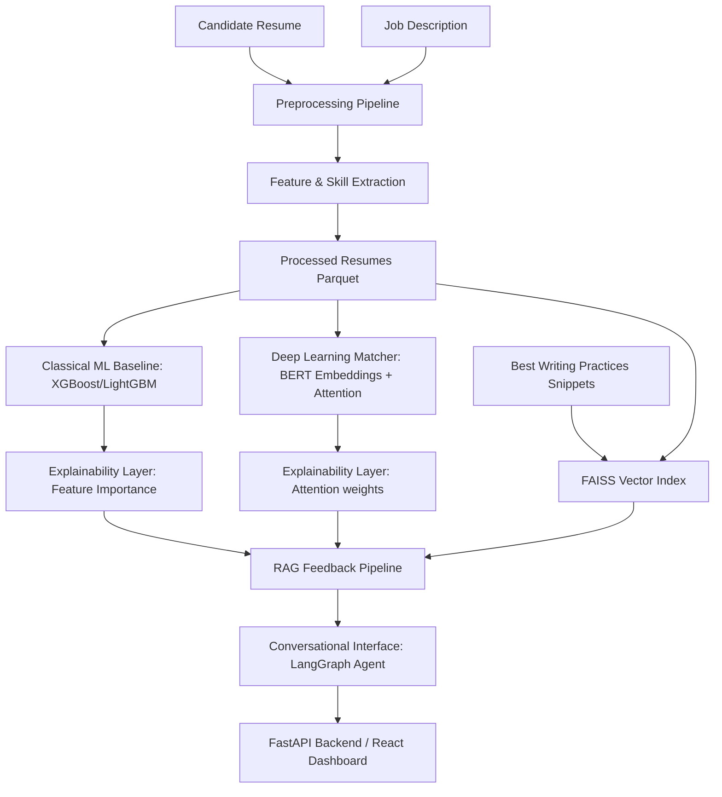

# ResumeIQ

ResumeIQ is an end-to-end, locally-runnable AI system that evaluates candidate resumes against job requirements, produces personalized, explainable feedback, and provides a conversational interface for candidates to discuss their results.

## Architecture



## Project Structure

```text
resumeiq/
  data/                  # Raw resumes_dataset.jsonl + processed parquet + synthetic JDs
  notebooks/             # EDA and model experiments
  src/
    preprocessing/       # Clean, normalize, deduplicate, extract entities (regex-based)
    models/              # Match score predictor (XGBoost/LightGBM) & PyTorch BERT model
    retrieval/           # LangChain RAG pipeline with FAISS
    feedback/            # Explainability metrics & feedback synthesis
    agent/               # LangGraph ReAct conversational agent
    api/                 # FastAPI backend
  frontend/              # React frontend using Tailwind CSS
  tests/                 # PyTest suite
  requirements.txt       # Dependencies
```

## Setup & Running

### Prerequisites
- Python 3.13.5
- Node.js (for frontend)
- Ollama (for local LLM feedback generation, e.g. Llama 3.1 or Mistral)

### Installation
1. Create and activate a Python virtual environment:
   ```bash
   python -m venv .venv
   .venv\Scripts\activate
   ```
2. Install Python dependencies:
   ```bash
   pip install -r requirements.txt
   ```

### Running EDA (Phase 1)
To run the preprocessing, cleaning, and EDA metrics printout:
```bash
python src/preprocessing/run_eda.py
```

### Running Tests
To run the automated tests covering preprocessing and extraction:
```bash
pytest tests/
```

## Known Limitations & Weak Labels
1. **Synthetic Seed JDs**: Since the raw resumes dataset did not contain target job descriptions, a seed companion set of 40 job descriptions was programmatically synthesized and saved to `data/job_descriptions.jsonl`.
2. **Category as Weak Labels**: The candidate category is used as a weak label proxy for "best-fit role" matching, meaning the models are trained to predict the category match rather than validated, verified hiring success metrics.
3. **No spaCy/SHAP**: In compliance with technical constraints, no external NER libraries (like spaCy) or SHAP explainers are used. Features are extracted using regex and custom dictionary mappings, and explainability is built using direct model feature importance and BERT multi-head attention scores.
