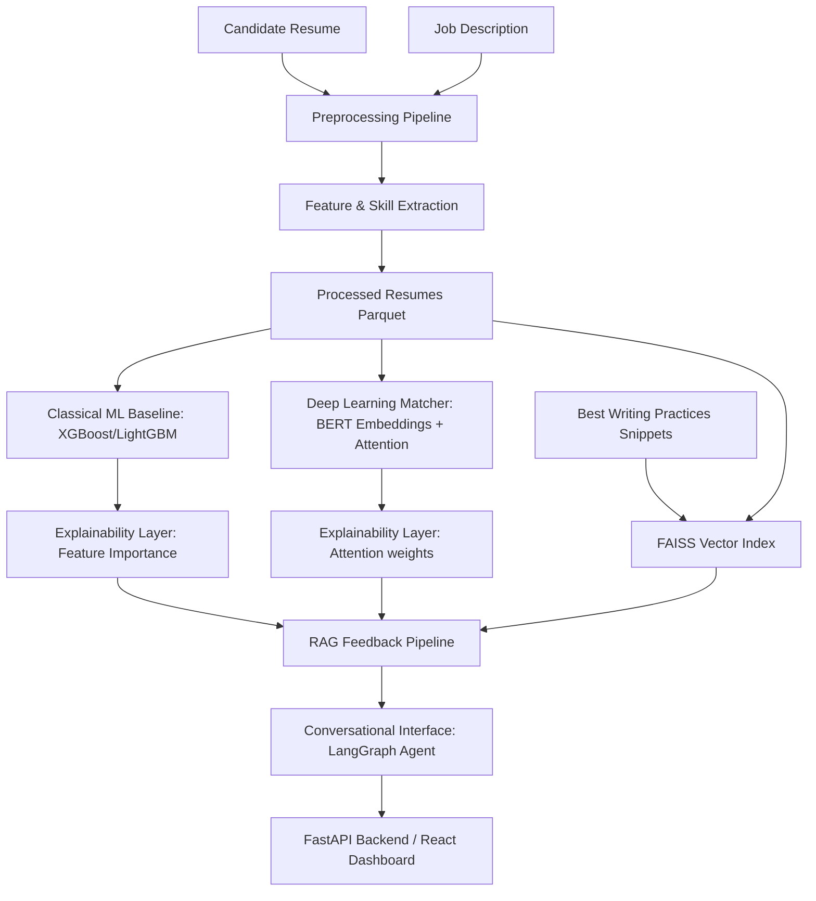

# ResumeIQ

ResumeIQ is an end-to-end, locally-runnable AI system that evaluates candidate resumes against job requirements, produces personalized, explainable feedback, and provides a conversational interface for candidates to discuss their results.

## Architecture



## Project Structure

```text
resumeiq/
  data/                  # Raw resumes_dataset.jsonl + processed parquet + synthetic JDs
  notebooks/             # EDA and model experiments
  src/
    preprocessing/       # Clean, normalize, deduplicate, extract entities (regex-based)
    models/              # Match score predictor (XGBoost/LightGBM) & PyTorch BERT model
    retrieval/           # LangChain RAG pipeline with FAISS
    feedback/            # Explainability metrics & feedback synthesis
    agent/               # LangGraph ReAct conversational agent
    api/                 # FastAPI backend
  frontend/              # React frontend using Tailwind CSS
  tests/                 # PyTest suite
  requirements.txt       # Dependencies
```

## Setup & Running

### Prerequisites
- Python 3.13.5
- Node.js (for frontend)
- Ollama (for local LLM feedback generation, e.g. Llama 3.1 or Mistral)

### Installation
1. Create and activate a Python virtual environment:
   ```bash
   python -m venv .venv
   .venv\Scripts\activate
   ```
2. Install Python dependencies:
   ```bash
   pip install -r requirements.txt
   ```

### Running EDA (Phase 1)
To run the preprocessing, cleaning, and EDA metrics printout:
```bash
python src/preprocessing/run_eda.py
```

### Running Tests
To run the automated tests covering preprocessing and extraction:
```bash
pytest tests/
```

## Phase 1 EDA Summary
The corrected dataset contains 3,124 unique resumes after removing 376 near-duplicate resumes from the original 3,500 entries.
- **Completeness**: All raw fields (ResumeID, Category, Name, Email, Phone, Location, Summary, Skills, Experience, Education, Text, Source) are 100% complete.
- **Top 5 Categories**:
  1. Data Science: 170 (5.44%)
  2. Java Developer: 168 (5.38%)
  3. Python Developer: 161 (5.15%)
  4. SQL Developer: 149 (4.77%)
  5. DevOps: 140 (4.48%)
- **Cleaned Text Length Distribution**:
  - Min Length: 202 characters
  - Max Length: 55,681 characters
  - Mean Length: 3,126 characters
  - Median Length: 1,845 characters

## How Scoring Works
The ResumeIQ fit score is a structured, rebalanced composite score designed to weigh candidate qualifications fairly and prevent keyword stuffing. It is **not** a single end-to-end learned prediction.

The score is computed as:
$$\text{Fit Score} = 0.40 \cdot \text{Skill Overlap} + 0.30 \cdot \text{Experience Match} + 0.15 \cdot \text{Degree Match} + 0.15 \cdot \text{Model Semantic Score}$$

### Sub-Score Explanations:
1. **Skill Overlap (40% weight)**: Measures the direct technical keyword overlap between the candidate's extracted skills and the required skills list ($\text{matched\_skills} / \text{required\_skills}$).
2. **Experience Match (30% weight)**: Evaluates the candidate's years of experience against the required experience. If the candidate meets or exceeds the requirement, they receive a score of $1.0$. If there is an experience gap, the score is reduced proportionally ($\max(0.0, 1.0 - \frac{\text{gap}}{\text{required\_experience}}$).
3. **Degree Match (15% weight)**: A binary check ($1.0$ or $0.0$) evaluating whether the candidate's highest degree level (None, Bachelor's, Master's, PhD) meets or exceeds the required education level.
4. **Model Semantic Score (15% weight)**: The probability output of the trained model (incorporating TF-IDF cosine similarity), representing overall vocabulary similarity and semantic alignment.

## Known Limitations & Weak Labels
1. **Synthetic Seed JDs**: Since the raw resumes dataset did not contain target job descriptions, a companion set of 40 job descriptions was programmatically synthesized and saved to `data/job_descriptions.jsonl`.
2. **Category as Weak Labels**: The candidate category is used as a weak label proxy for "best-fit role" matching, meaning the models are trained to predict the category match rather than validated hiring success.
3. **No spaCy/SHAP**: In compliance with technical constraints, no external NER libraries (like spaCy) or SHAP explainers are used. Features are extracted using regex and custom dictionary mappings, and explainability is built using model feature importances and BERT multi-head attention scores.
4. **Zero-Experience Resumes**: Approximately 39% of the resumes in the corpus do not state numeric years of experience or contain unfilled template placeholders (e.g. "bringing number years experience"), resulting in an extracted experience of 0.0 years. This is a known dataset limitation.
5. **LoRA fine-tuning**: Not attempted — Bypassed to maintain containerized runtime stability and avoid high CPU overhead during contrastive training in the deployment environment.

## Docker Containerization

ResumeIQ can be run inside a fully self-contained Docker Compose network.

### Steps to Run:
1. Ensure Docker Desktop is installed and running on your system.
2. Build and start the services:
   ```bash
   docker-compose up --build
   ```
3. Once running, open the applications:
   - **Interactive Frontend Dashboard**: `http://localhost:3000`
   - **FastAPI Backend Swagger Docs**: `http://localhost:8000/docs`

### Configuring Retrained Models:
If you retrain the baseline LightGBM/XGBoost models or regenerate the FAISS index, you can point the docker container at your updated artifacts without rebuilding the image by using volume mounts in `docker-compose.yml`:
```yaml
  backend:
    volumes:
      - ./src/models/artifacts:/app/src/models/artifacts
      - ./src/retrieval/artifacts/faiss_index:/app/src/retrieval/artifacts/faiss_index
```


